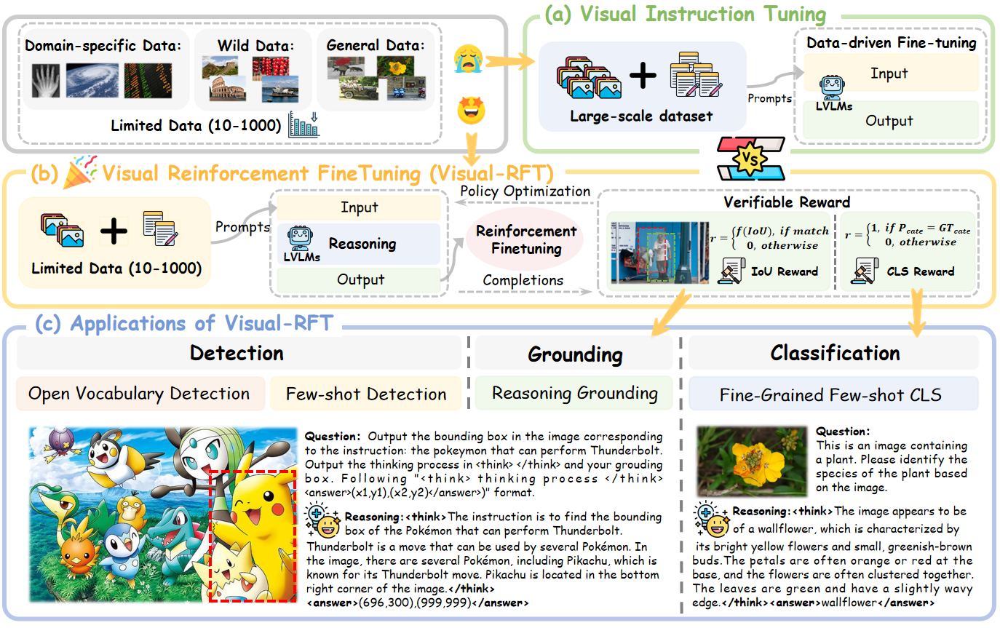
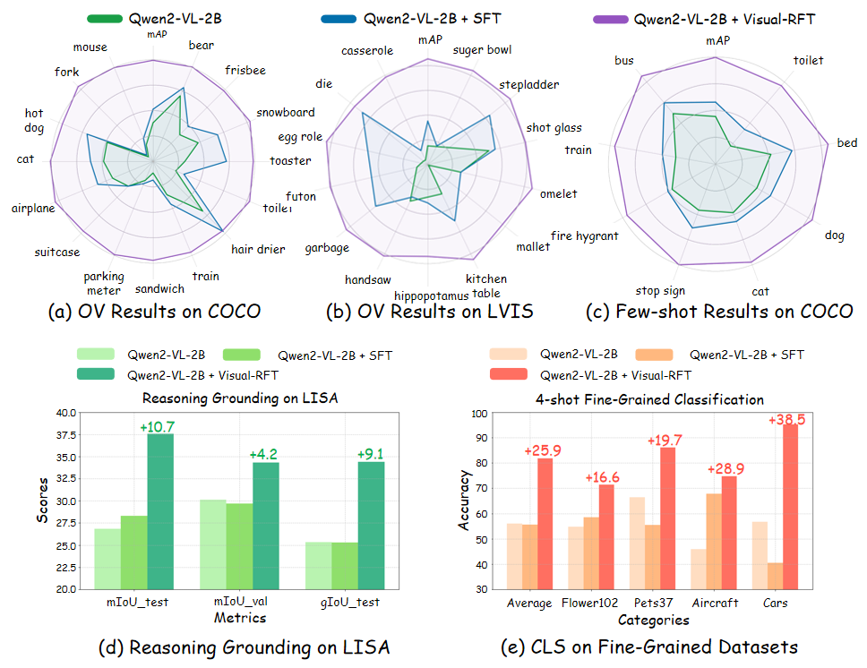
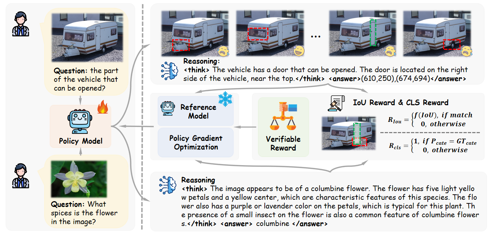
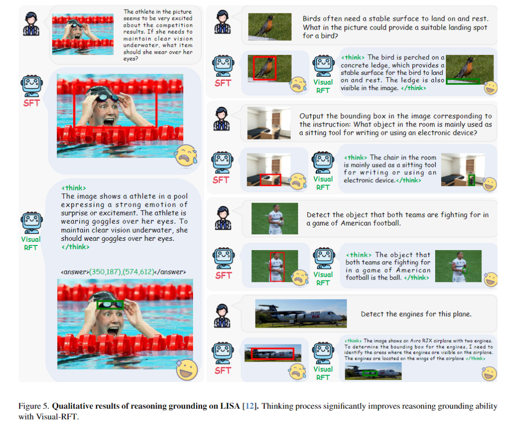
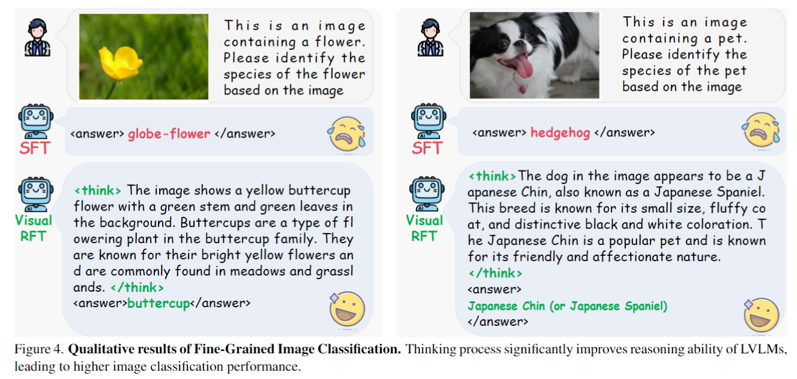

<p align="center">
<!--   <h1 align="center"></h1> -->
  <h1 align="center">Visual-RFT: Visual Reinforcement Fine-Tuning</h1>
    <p align="center">
    <a href="https://github.com/Liuziyu77"><strong>Ziyu Liu*</strong></a>
    ·
    <a href="https://github.com/SunzeY"><strong>Zeyi Sun*</strong></a>
    ·
    <a href="https://yuhangzang.github.io/"><strong>Yuhang Zang</strong></a>
    ·
    <a href="https://lightdxy.github.io/"><strong>Xiaoyi Dong</strong></a>
    ·
    <a href="https://scholar.google.com/citations?user=sJkqsqkAAAAJ"><strong>Yuhang Cao</strong></a>
    ·
    <a href="https://kennymckormick.github.io/"><strong>Haodong Duan</strong></a>
    ·
     <a href="http://dahua.site/"><strong>Dahua Lin</strong></a>
    ·
     <a href="https://myownskyw7.github.io/"><strong>Jiaqi Wang</strong></a>
  </p>
<!--   <h2 align="center">Accepted By ICLR 2025!</h2> -->
<!-- 🏠<a href="https://liuziyu77.github.io/MIA-DPO/">Homepage</a></h3>| -->
  📖<a href="https://arxiv.org/abs/2503.01785">Paper</a> |
  🤗<a href="https://huggingface.co/collections/laolao77/virft-datasets-67bc271b6f2833eccc0651df">Datasets</a> | 🤗<a href="https://huggingface.co/papers/2503.01785">Daily Paper</a></h3>
<div align="center"></div>
<p align="center">
  <p>
🌈We introduce <strong>Visual Reinforcement Fine-tuning (Visual-RFT)</strong>, the first comprehensive adaptation of <strong>Deepseek-R1's RL strategy</strong> to the <strong>multimodal field</strong>. We use the Qwen2-VL-2/7B model as our base model and design a <strong>rule-based verifiable reward</strong>, which is integrated into a <strong>GRPO-based reinforcement fine-tuning framework</strong> to enhance the performance of LVLMs across various visual perception tasks. <strong>ViRFT</strong> extends R1's reasoning capabilities to multiple visual perception tasks, including various detection tasks like <strong>Open Vocabulary Detection, Few-shot Detection, Reasoning Grounding, and Fine-grained Image Classification</strong>.
  </p>
<!--     <a href="">
       
    </a> -->
<br>

<a href="">
  
</a>

## 📢 News
- 🚀 [03/12/2025] We release the code to build the <a href="https://github.com/Liuziyu77/Visual-RFT/tree/main/dataset">dataset</a> on your own data.
- 🚀 [03/04/2025] We release our <a href="https://arxiv.org/abs/2503.01785">Paper</a>.
- 🚀 [03/04/2025] We upload our training datasets to <a href="https://huggingface.co/collections/laolao77/virft-datasets-67bc271b6f2833eccc0651df">Huggingface</a>.
- 🚀 [03/04/2025] We release **ViRFT** repository and our training code.

## 💡 Highlights
- 🔥 **Visual Reinforcement Fine-tuning (Visual-RFT)**: We introduce Visual Reinforcement Fine-tuning (**Visual-RFT**), which extends reinforcement learning with verified rewards on visual perception tasks that are effective with limited data for fine-tuning.
- 🔥 **Verified Rewards**: We design different **verified rewards** for different visual tasks that enable efficient, high-quality reward computation at a negligible cost. This allows the seamless transfer of DeepSeek R1's style reinforcement learning strategy to the multi-modal domain.
- 🔥 **Extensive Experiments**: We conduct **extensive experiments** on various visual perception tasks, including fine-grained image classification, open vocabulary object detection, few-shot object detection, and reasoning grounding.
- 🔥 **Open Source**: We fully **open-source** the training code, training data, and evaluation scripts on Github to facilitate further research.


<a href="">
  
</a>


## Framework
**Visual-RFT** framework is shown below. The policy model generates a group of responses based on the input. Each response is passed through a verifiable reward function to compute the reward. After group computation of the rewards for each output, the quality of each response is evaluated and used to update the policy model. To ensure the stability of the policy model training, **Visual-RFT** use KL divergence to limit the difference between the policy model and the reference model. For ***more implementation details***, including data generation, the design of the ***verifiable reward***, and other aspects, please refer to our paper.

<a href="">
  
</a>

## 🛠️ Setup
```
git clone https://github.com/Liuziyu77/Visual-RFT.git
conda create -n Visual-RFT python=3.10
conda activate Visual-RFT
bash setup.sh
```

## Inference
We have uploaded the model trained on 200+ samples from the LISA dataset (<a href="https://huggingface.co/Zery/Qwen2-VL-7B_visual_rft_lisa_IoU_reward">🤗Huggingface</a>). You can use it to evaluate the inference performance of **Reasoning Grounding**. More details refer to `demo`.

## Training
### Datasets
To train on our various visual perception tasks, first visit <a href="https://huggingface.co/collections/laolao77/virft-datasets-67bc271b6f2833eccc0651df">Huggingface Datasets</a> to download the datasets. We have uploaded different datasets for different tasks.
| Datasets             |Task  |Setting          | Description                                                                 |
|------------------------------|------|----|-----------------------------------------------------------------------------|
| laolao77/ViRFT_COCO   |Detection | -                 | It includes all categories from COCO, with a total of 6k entries.            |
| laolao77/ViRFT_COCO_base65     | Detection |Open Vocabulary       | It includes 65 basic categories from COCO, with a total of 6k entries.      |
| laolao77/ViRFT_COCO_8_cate_4_shot |  Detection| Few-shot | It includes 8 selected categories from COCO.                                 |
| laolao77/ViRFT_LVIS_few_shot     |  Detection| Few-shot      | It includes 6 selected categories from COCO.                                 |
| laolao77/ViRFT_CLS_flower_4_shot |  Classification| Few-shot     | It includes the 102 categories from the Flower102 dataset, with 4 images per category. |
| laolao77/ViRFT_CLS_fgvc_aircraft_4_shot|  Classification| Few-shot | It includes the 100 categories from the FGVC-Aircraft dataset, with 4 images per category. |
| laolao77/ViRFT_CLS_car196_4shot   |  Classification| Few-shot   | It includes the 196 categories from the Stanford Cars dataset, with 4 images per category. |
| laolao77/ViRFT_CLS_pets37_4shot  |  Classification| Few-shot    | It includes the 37 categories from the Pets37 dataset, with 4 images per category. |
| LISA dataset | Grounding | - | Reasoning Grounding|
> 🔔 If your want to build a dataset on your own data, you can refere to `dataset/build_dataset.ipynb`. Just provide a `json` file with `image`, `promble` and 'solution'.

### GRPO
After downloading the dataset, you can start training using the following example bash script. Our bash scripts are in ```/src/scripts```
> 🔔 There's no need for prolonged training. For a dataset with only a few hundred samples, 200 steps should be sufficient.
```
# There's no need for prolonged training. For a dataset with only a few hundred samples, 200 steps should be sufficient.
export DEBUG_MODE="true"
export LOG_PATH="./debug_log_2b_GRPO_coco_base65cate_6k.txt"

export DATA_PATH=./share_data/ViRFT_COCO_base65   ### your local dataset downloading from huggingface
export CKPT_PATH=./share_models/Qwen2-VL-2B-Instruct    ### Qwen2-VL-2B checkpoint path
export SAVE_PATH=./share_models/Qwen2-VL-2B-Instruct_GRPO_coco_base65cate_6k    ### save path

torchrun --nproc_per_node="8" \
    --nnodes="1" \
    --node_rank="0" \
    --master_addr="127.0.0.1" \
    --master_port="12345" \
    src/open_r1/grpo.py \
    --output_dir ${SAVE_PATH}  \
    --model_name_or_path ${CKPT_PATH} \
    --dataset_name ${DATA_PATH} \
    --deepspeed local_scripts/zero3.json \
    --max_prompt_length 1024 \
    --per_device_train_batch_size 1 \
    --gradient_accumulation_steps 2 \
    --logging_steps 1 \
    --bf16 \
    --report_to wandb \
    --gradient_checkpointing false \
    --attn_implementation flash_attention_2 \
    --max_pixels 401408 \
    --num_train_epochs 1 \
    --run_name Qwen2-VL-2B_GRPO_coco_base65cate_6k \
    --save_steps 100 \
    --save_only_model true \
    --num_generations 8 '
```
**OOM Tips**

It is important to note that if you encounter an OOM (Out of Memory) issue during training, you can resolve it by configuring `zero3.json`. For the 7B model, if the issue persists after enabling `zero3.json`, you can try lowering the `num_generations` to 4.
```
--deepspeed ./local_scripts/zero3.json
```
Moreover, setting `--gradient_checkpointing` to `true` can save memory, allowing for a higher `--num_generations` limit, which leads to better training performance. However, it will slow down the training process.
```
--gradient_checkpointing True
```
To further save GPU memory, you can use the `zero3_offload.json` configuration.

If you're still encountering OOM issues, you can also reduce the resolution of the images in the training dataset!

### SFT
We use <a href="https://github.com/hiyouga/LLaMA-Factory">LLaMa-Factory</a> for supervised fine-tuning (SFT) of the model. You can convert the downloaded dataset into the corresponding Qwen SFT format for training.

## Evaluation
We conducted extensive experiments on various visual perception tasks, including **fine-grained image classification**, **open vocabulary object detection**, **few-shot object detection**, and **reasoning grounding**. **ViRFT** achieves remarkable performance improvements across these tasks with minimal data and computational cost, significantly surpassing supervised fine-tuning baselines.

> We provide a step-by-step tutorial for using the evaluation code. If you encounter any issues, feel free to open an issue.

### COCO Evaluation
You can use the files in the ```coco_evaluation``` directory for model inference and obtain evaluation results. Our code supports multi-GPU evaluation, and it requires at least two GPUs.

For ***inference***: 
```
cd ./coco_evaluation
python Qwen2_VL_coco_infere.py
```
Please note that some file paths and model paths in ```Qwen2_VL_coco_infere.py``` need to be modified.
```
### line 167-168, change for your model path and model base.
model_path = "./share_models/Qwen2-VL-2B-Instruct_RL/"  # RL model
model_base = "./share_models/Qwen2-VL-2B-Instruct/"  # original Qwen2-VL model
### line 182, change for your coco val annnotation path
with open('./data/coco/annotations/instances_val2017.json', 'r') as json_file:
### line 224, Modify according to your own image path.
image_path = './data/coco/val2017/'+image['file_name']    
### line 231-241, selecte the categories you want to evaluation
selected_cate = ['bus', 'train', 'fire hydrant', 'stop sign', 'cat', 'dog', 'bed', 'toilet']
### line 350, results save path
with open(f'prediction_results.json', 'w') as json_file:
```
The inference results will be saved in `JSON` format and later used for evaluation.

For ***evaluation***, just run ```./coco_evaluation/evaluation.ipynb``` step by step.

### LVIS Evaluation
You can use the files in the ```lvis_evaluation``` directory for model inference and obtain evaluation results. Our code supports multi-GPU evaluation, and it requires at least two GPUs.

For ***inference***: 
```
cd ./lvis_evaluation
python Qwen2_VL_lvis_infere.py
```
Please note that some file paths and model paths in ```Qwen2_VL_lvis_infere.py``` need to be modified.
```
### line 169-170, change for your model path and model base
model_path = "./share_models/Qwen2-VL-2B-Instruct_RL/"  # RL model
model_base = "./share_models/Qwen2-VL-2B-Instruct/"  # original Qwen2-VL model
### line 184, change for your lvis val annnotation path
with open('./data/lvis/annotations/lvis_v1_val.json', 'r') as json_file:
### line 228, Modify according to your own image path.
image_path = './data/lvis/' + "/".join(parts[-2:])   
### line 234-242, selecte the categories you want to evaluation
selected_cate = ['horse_buggy', 'die', 'kitchen_table', 'omelet', 'papaya', 'stepladder']
### line 346, results save path
with open(f'prediction_results.json', 'w') as json_file:
```
The inference results will be saved in `JSON` format and later used for evaluation.

For ***evaluation***, just run ```./lvis_evaluation/lvis_evaluation.ipynb``` step by step.

### Classification Evaluation
You can use the files in the ```classification``` directory for model inference and obtain evaluation results. Our code supports multi-GPU evaluation, and it requires at least two GPUs.
```
cd ./classification
python Qwen2_VL_classification_infere.py
```
Please note that the model paths in ```Qwen2_VL_classification_infere.py``` need to be modified.
```
### line 61-63, change for your model path and model base
model_path = "./share_models/Qwen2-VL-2B-Instruct_RL/"  # after RL
model_base = "./share_models/Qwen2-VL-2B-Instruct/"  # original Qwen2-VL
```
Inference and result computation are performed simultaneously. After the program finishes running, the number of correctly classified items will be displayed in the command line, and the accuracy is obtained by dividing it by the length of the validation set. (Flower102: 2463, Pets37: 3669, stanford cars: 8041, fgvc-aircraft: 3333)

> 🔔 Sometimes, due to environment issues, the model may produce incorrect inferences when `use_cache = None`. You might consider explicitly setting `use_cache = True`.
> `generated_ids = model.generate(**inputs, max_new_tokens=1024, use_cache=True)`

### Evaluation Results
*We have conducted **extensive experiments**; please refer to our paper for further details*.


### Case Study
In the following figure, we present some inference examples from **ViRFT**. We observe that the thinking process significantly enhances the reasoning and grounding ability with **ViRFT**. Through **ViRFT**, Qwen2-VL learns to think critically and carefully examine the image to produce accurate grounding results.
<a href="">
  
</a>
We also present some inference cases of the model when handling *fine-grained classification tasks*. These results not demonstrate the strong generalization ability of **ViRFT** across various visual tasks.
<a href="">
  
</a>


## ✒️Citation
```
@article{liu2025visual,
  title={Visual-RFT: Visual Reinforcement Fine-Tuning},
  author={Liu, Ziyu and Sun, Zeyi and Zang, Yuhang and Dong, Xiaoyi and Cao, Yuhang and Duan, Haodong and Lin, Dahua and Wang, Jiaqi},
  journal={arXiv preprint arXiv:2503.01785},
  year={2025}
}
```

## 📄 License
  **Usage and License Notices**: The data and code are intended and licensed for research use only.
License: Attribution-NonCommercial 4.0 International It should abide by the policy of OpenAI: https://openai.com/policies/terms-of-use

## Acknowledgement
We sincerely thank projects <a href="https://github.com/Deep-Agent/R1-V">R1-V</a>, <a href="https://github.com/huggingface/open-r1">Open-R1</a>, and <a href="https://github.com/EvolvingLMMs-Lab/open-r1-multimodal">Open-r1-multimodal</a> for providing their open-source resources.


